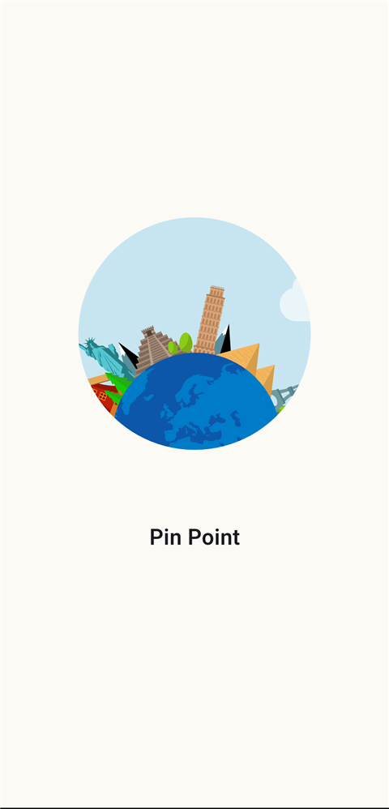
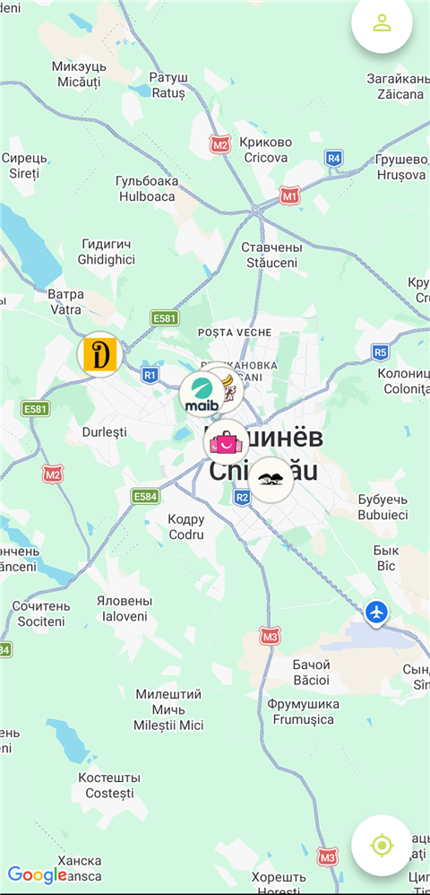
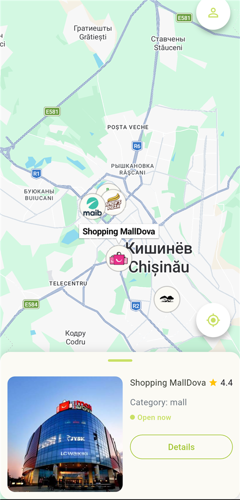
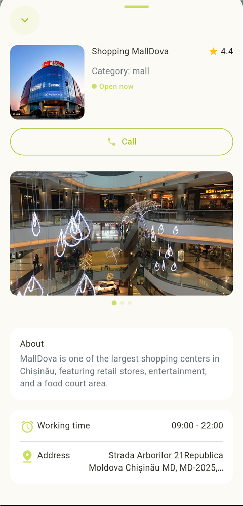
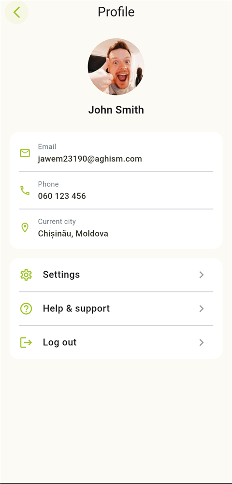

# Pin Point

A Flutter app for discovering and viewing points of interest on a map: users see location pins on a Google Map, can open a preview with a short summary, view a detailed location card (photos, address, working hours, contacts), and find their current position.

## Screenshots

| Splash | Map | Pin preview | Location details | Profile |
|---|---|---|---|---|
|  |  |  |  |  |

- **Splash** — animated Lottie splash screen shown on app launch.
- **Map** — Google Map with category pins (clustered near the city center) and buttons to open the profile or center on the user's current location.
- **Pin preview** — tapping a pin opens a bottom card with the place's photo, name, rating, category, and open/closed status, plus a button to open full details.
- **Location details** — a full screen with a photo carousel, description, working hours, address, and a call button.
- **Profile** — the current user's info (avatar, name, email, phone, city) and links to settings, help, and logout.

## Tech Stack

- **Flutter** / Dart
- [`google_maps_flutter`](https://pub.dev/packages/google_maps_flutter) — displaying the map and markers
- [`geolocator`](https://pub.dev/packages/geolocator) — getting the user's current position
- State management: `StatefulWidget` / `setState`
- [`lottie`](https://pub.dev/packages/lottie) + [`animated_splash_screen`](https://pub.dev/packages/animated_splash_screen) — animated splash screen
- [`flutter_launcher_icons`](https://pub.dev/packages/flutter_launcher_icons) — app icon generation

## Project Structure

```
lib/
  core/                     # shared code not tied to a specific feature
    theme/                  # colors, app theme (app_theme.dart)
    utils/                  # helpers (e.g. working_hours_helper.dart)
  features/                 # code organized by feature
    map/                    # map and everything related to it
      data/
        mock/               # mock location data for development
        models/             # ModelLocation — map pin data model
      mappers/               # maps ModelLocation to Marker for Google Maps
      widgets/               # preview card, detail screen, image carousel, etc.
      map_screen.dart        # main screen with the map
    profile/                # user profile screen
      data/
      profile_screen.dart
  main.dart                 # entry point, screen orientation setup
  splash_screen.dart        # animated splash screen shown on launch
```

Each feature is a self-contained folder with its own data (`data`) and widgets (`widgets`); shared code lives in `core`.

## Getting Started

1. Install dependencies:
   ```bash
   flutter pub get
   ```

2. Configure a Google Maps API key (required to display the map):
   - Android: `android/app/src/main/AndroidManifest.xml`, the `<meta-data android:name="com.google.android.geo.API_KEY" .../>` tag
   - iOS: `ios/Runner/AppDelegate.swift`, the `GMSServices.provideAPIKey(...)` call

   Get a key from the [Google Cloud Console](https://console.cloud.google.com/) (enable Maps SDK for Android/iOS).

3. Run the app:
   ```bash
   flutter run
   ```

## Permissions

The app requires device location access (to show the user's current position on the map and for the "my location" button).

## Data

- Location data currently comes from a mock source (`lib/features/map/data/mock/mock_locations.dart`); integration with a real backend is not implemented.
